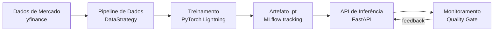
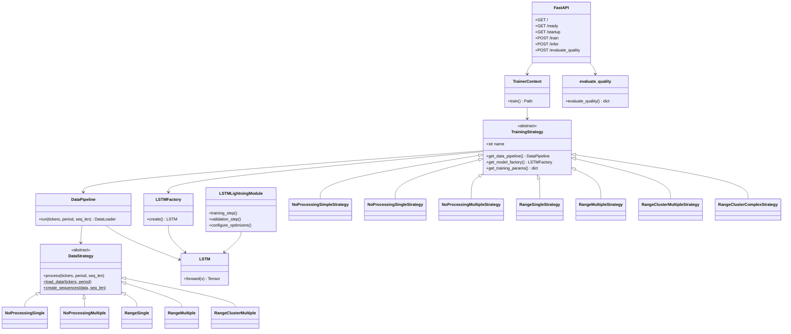
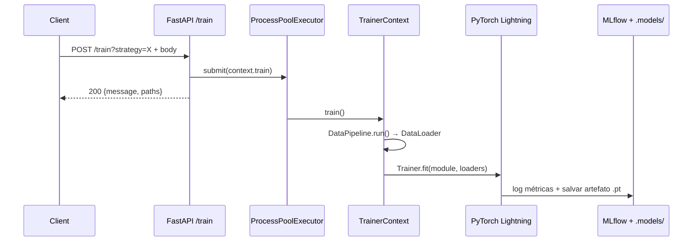
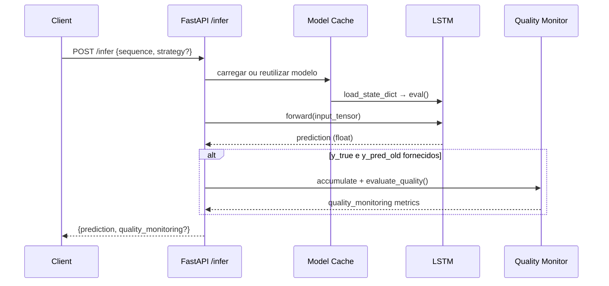
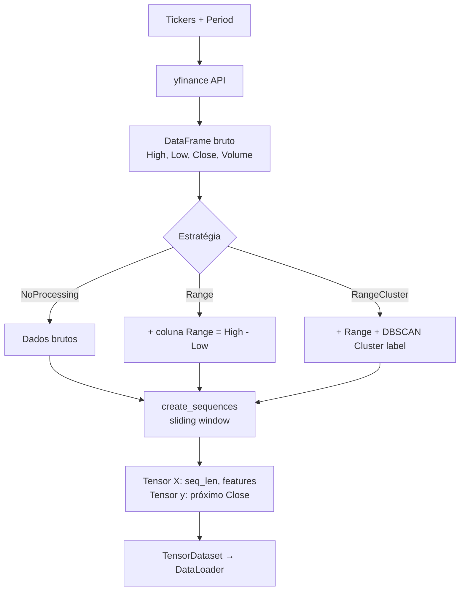
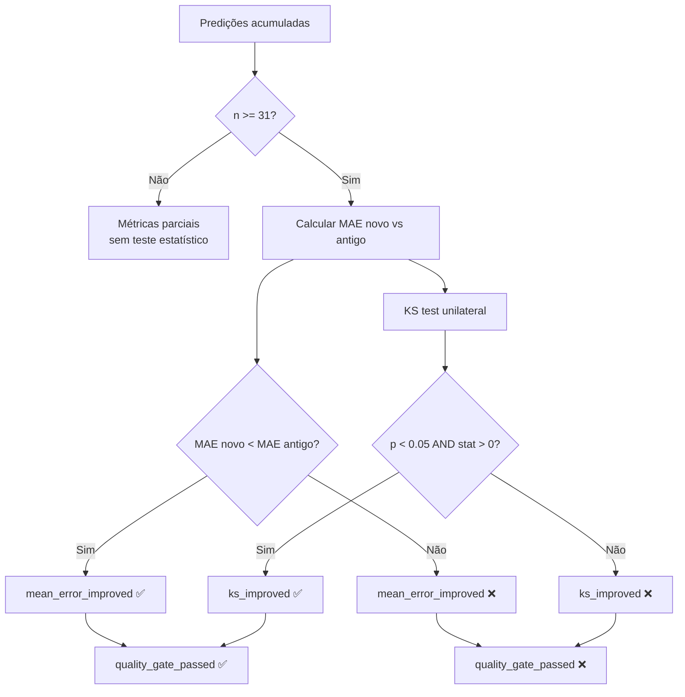
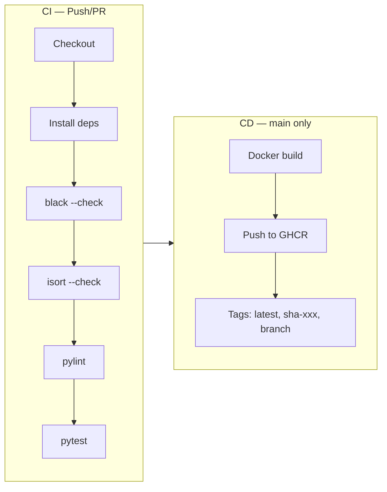

# LSTM Service — Produtização de Modelos de Séries Temporais

Camada de produtização para expor, treinar e monitorar modelos LSTM de séries temporais (preço de ações) via **FastAPI**, com rastreamento de experimentos via **MLflow** e treino com **PyTorch Lightning**.

---

## Índice

1. [Visão Geral](#visão-geral)
2. [Estrutura do Projeto](#estrutura-do-projeto)
3. [Arquitetura de Alto Nível](#arquitetura-de-alto-nível)
4. [Início Rápido](#início-rápido)
5. [Endpoints da API](#endpoints-da-api)
6. [Estratégias de Treinamento](#estratégias-de-treinamento)
7. [Pipeline de Dados](#pipeline-de-dados)
8. [Monitoramento de Qualidade](#monitoramento-de-qualidade)
9. [Docker](#docker)
10. [CI/CD](#cicd)
11. [Testes](#testes)
12. [Documentação dos Módulos](#documentação-dos-módulos)

---

## Visão Geral

Este projeto implementa um serviço completo de machine learning para previsão de preços de ações usando redes LSTM. O sistema segue os padrões **Strategy** (para dados e treinamento) e **Factory Method** (para construção de modelos), com monitoramento estatístico contínuo da qualidade das predições.



---

## Estrutura do Projeto

```
productization/
├── README.md                    # ← Você está aqui
├── Dockerfile                   # Imagem Docker com CUDA + Python 3.13
├── CONTRIBUTING.md
├── LICENSE
├── SECURITY.md
└── src/
    ├── pyproject.toml           # Dependências e configuração de ferramentas
    ├── app/                     # Pacote principal da aplicação
    │   ├── README.md            # Documentação detalhada do módulo app
    │   ├── __init__.py          # Logging, metadados, .env
    │   ├── main.py              # FastAPI: endpoints + middleware + error handlers
    │   ├── model/               # LSTM, Factory, Pipeline de Dados
    │   │   └── README.md
    │   ├── inference/           # Monitoramento de qualidade (KS test)
    │   │   └── README.md
    │   ├── schemas/             # Contratos de request/response
    │   │   └── README.md
    │   └── train/               # Estratégias de treinamento + orquestração
    │       └── README.md
    ├── tests/                   # Suíte de testes (pytest)
    │   └── README.md
    └── infra/terraform/         # Infra-as-code
```

---

## Arquitetura de Alto Nível

### Diagrama de Classes (Núcleo)



---

## Início Rápido

### Pré-requisitos

- Python ≥ 3.13
- (Opcional) NVIDIA GPU com CUDA 12.4 para treino acelerado

### 1. Clonar e configurar

```bash
git clone https://github.com/FIAP/Pos_Tech_MLET.git
cd Pos_Tech_MLET/productization/src

python -m venv .venv
# Windows
.venv\Scripts\Activate.ps1
# Linux/Mac
source .venv/bin/activate

pip install -e ".[dev,test]"
```

### 2. Iniciar o servidor

```bash
uvicorn app.main:app --reload --host 0.0.0.0 --port 8000
```

### 3. Verificar que está saudável

```bash
curl http://localhost:8000/
# {"status": "healthy"}
```

### 4. Treinar um modelo

```bash
curl -X POST "http://localhost:8000/train?strategy=NoProcessingSimpleStrategy" \
  -H "Content-Type: application/json" \
  -d '{
    "tickers": ["AAPL"],
    "period": "1y",
    "seq_len": 30,
    "num_epochs": 10,
    "learning_rate": 0.001,
    "batch_size": 32,
    "layer_config": {"lstm1": "LSTM", "linear1": "Linear"},
    "lstm_params": {
      "input_size": 4,
      "hidden_size": 64,
      "num_layers": 2,
      "output_size": 1,
      "batch_first": true
    }
  }'
```

### 5. Fazer uma predição

```bash
curl -X POST http://localhost:8000/infer \
  -H "Content-Type: application/json" \
  -d '{
    "strategy": "NoProcessingSimple",
    "sequence": [
      [187.11, 184.50, 186.80, 45000000.0],
      [188.20, 185.10, 187.95, 42000000.0],
      [189.00, 186.00, 188.75, 39800000.0]
    ]
  }'
```

---

## Endpoints da API

| Método | Rota | Tag | Descrição |
|---|---|---|---|
| `GET` | `/` | Configuração | Liveness probe |
| `GET` | `/ready` | Configuração | Readiness probe |
| `GET` | `/startup` | Configuração | Startup probe |
| `POST` | `/train` | Treinamento | Agendamento assíncrono de treino |
| `POST` | `/infer` | Inferência | Predição em tempo real |
| `POST` | `/evaluate_quality` | Monitoramento | Avaliação em lote da qualidade |

### Fluxo de Treinamento



### Fluxo de Inferência



---

## Estratégias de Treinamento

| Estratégia | Tickers | Feature Eng. | Clustering | Complexidade |
|---|---|---|---|---|
| `NoProcessingSimpleStrategy` | N | Nenhum | Não | Baixa |
| `NoProcessingSingleStrategy` | 1 | Nenhum | Não | Baixa |
| `NoProcessingMultipleStrategy` | N | Nenhum | Não | Baixa |
| `RangeSingleStrategy` | 1 | High - Low | Não | Média |
| `RangeMultipleStrategy` | N | High - Low | Não | Média |
| `RangeClusterMultipleStrategy` | N | High - Low | DBSCAN | Alta |
| `RangeClusterComplexStrategy` | N | High - Low | DBSCAN | Alta |

---

## Pipeline de Dados



---

## Monitoramento de Qualidade

O sistema implementa um **quality gate** com dois critérios:

1. **Erro médio** — o novo modelo tem MAE menor que o baseline
2. **Teste KS** — o teste de Kolmogorov-Smirnov confirma melhora estatisticamente significativa (p < 0.05)



---

## Docker

```bash
cd productization
docker build -t lstm-service .
docker run -p 8000:8000 lstm-service
```

A imagem utiliza **NVIDIA CUDA 12.4** + **Python 3.13** e cria um usuário não-root para segurança.

---

## CI/CD

Workflow: `.github/workflows/productization-ci-cd.yml`



- **CI** executa em pushes/PRs quando há alteração em `productization/**`
- **CD** roda apenas em `main` ou via `workflow_dispatch`
- Imagem publicada em `ghcr.io/<owner>/<repo>`

---

## Testes

```bash
cd productization/src

# Toda a suíte
pytest tests/ -v

# Com cobertura
pytest tests/ --cov=app --cov-report=html -v
```

| Arquivo de Teste | Módulo Testado |
|---|---|
| `test_lstm_factory.py` | `model/lstm.py` |
| `test_lstm_data.py` | `model/data.py` |
| `test_inference_quality_monitor.py` | `inference/quality.py` + `main.py` |
| `test_model_quality.py` | Benchmark estatístico |
| `test_training_strategies.py` | `train/model.py` |

---

## Documentação dos Módulos

Cada módulo possui seu próprio `README.md` com diagramas Mermaid, exemplos de código e explicações detalhadas:

| Módulo | Link | Conteúdo |
|---|---|---|
| `app` | [src/app/README.md](src/app/README.md) | Visão geral, endpoints, fluxo completo de demonstração |
| `model` | [src/app/model/README.md](src/app/model/README.md) | LSTM, Factory, Pipeline de Dados, camadas suportadas |
| `inference` | [src/app/inference/README.md](src/app/inference/README.md) | Quality gate, teste KS, integração com `/infer` |
| `schemas` | [src/app/schemas/README.md](src/app/schemas/README.md) | InferRequest, SuccessMessage, ErrorMessage, RESPONSES |
| `train` | [src/app/train/README.md](src/app/train/README.md) | 7 estratégias, TrainerContext, artefatos .pt |
| `tests` | [src/tests/README.md](src/tests/README.md) | Fixtures, cobertura, detalhamento de cada teste |
