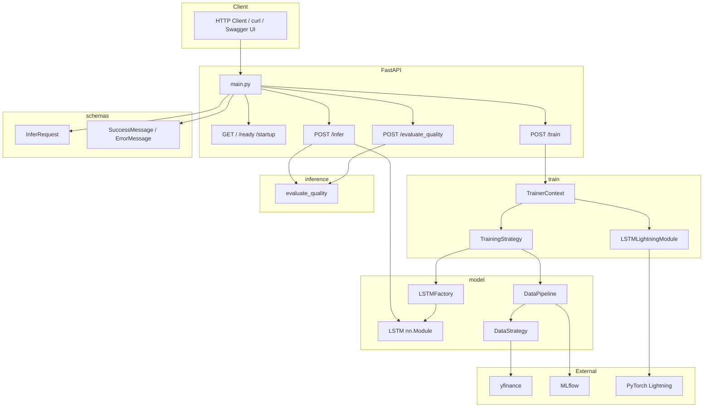
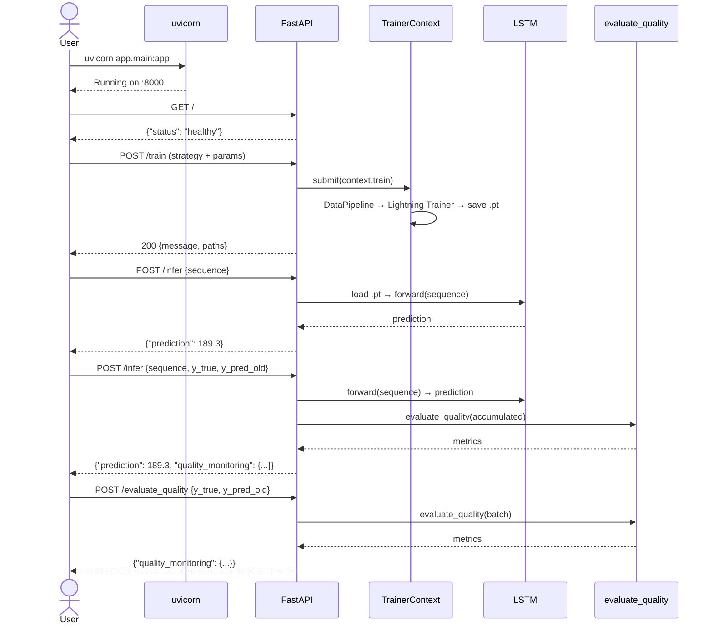

# Módulo `app` — Aplicação LSTM Service (FastAPI)

Este é o pacote principal da aplicação. Expõe uma API REST via **FastAPI** para **treinamento**, **inferência** e **monitoramento de qualidade** de modelos LSTM voltados à previsão de preços de ações.

---

## Estrutura do Pacote

```
app/
├── __init__.py          # Metadados, logging e carregamento de .env
├── main.py              # Ponto de entrada FastAPI (endpoints + middleware)
├── model/               # Arquitetura LSTM, Factory e Pipeline de Dados
│   ├── README.md
│   ├── lstm_params.py
│   ├── lstm.py
│   ├── data.py
│   └── __init__.py
├── inference/           # Monitoramento estatístico de qualidade
│   ├── README.md
│   ├── quality.py
│   └── __init__.py
├── schemas/             # Contratos de request/response
│   ├── README.md
│   ├── endpoints.py
│   ├── responses.py
│   └── __init__.py
└── train/               # Estratégias de treinamento e orquestração
    ├── README.md
    ├── model.py
    ├── __init__.py
    └── .models/         # Artefatos .pt (gerado em runtime)
```

---

## Arquitetura Geral



---

## Endpoints da API

| Método | Rota | Tag | Descrição |
|---|---|---|---|
| `GET` | `/` | Configuração | Health check (liveness probe) |
| `GET` | `/ready` | Configuração | Readiness probe |
| `GET` | `/startup` | Configuração | Startup probe |
| `POST` | `/train` | Treinamento | Agendar treino assíncrono de um modelo LSTM |
| `POST` | `/infer` | Inferência | Predição em tempo real + monitoramento opcional |
| `POST` | `/evaluate_quality` | Monitoramento | Avaliação em lote da qualidade do modelo |

---

## Passo-a-Passo: Como Demonstrar a Solução

### 1. Configurar o Ambiente

```bash
cd productization/src
python -m venv .venv
# Windows
.venv\Scripts\Activate.ps1
# Linux/Mac
source .venv/bin/activate

pip install -e ".[dev,test]"
```

### 2. Iniciar o Servidor

```bash
uvicorn app.main:app --reload --host 0.0.0.0 --port 8000
```

Acesse a documentação interativa em: `http://localhost:8000/api/v1/openapi.json`

### 3. Verificar Health Check

```bash
curl http://localhost:8000/
# {"status": "healthy"}
```

### 4. Treinar um Modelo

```bash
curl -X POST "http://localhost:8000/train?strategy=RangeMultipleStrategy" \
  -H "Content-Type: application/json" \
  -d '{
    "tickers": ["AAPL", "MSFT"],
    "period": "1y",
    "seq_len": 30,
    "num_epochs": 10,
    "learning_rate": 0.001,
    "batch_size": 32,
    "layer_config": {"lstm1": "LSTM", "linear1": "Linear"},
    "lstm_params": {
      "input_size": 10,
      "hidden_size": 64,
      "num_layers": 2,
      "output_size": 1,
      "batch_first": true
    }
  }'
```

### 5. Fazer Inferência

```bash
curl -X POST http://localhost:8000/infer \
  -H "Content-Type: application/json" \
  -d '{
    "strategy": "RangeMultiple",
    "sequence": [
      [187.11, 184.50, 186.80, 45000000.0, 2.61, 188.20, 185.10, 187.95, 42000000.0, 3.10],
      [188.20, 185.10, 187.95, 42000000.0, 3.10, 189.00, 186.00, 188.75, 39800000.0, 3.00]
    ],
    "y_true": 189.45,
    "y_pred_old": 190.18
  }'
```

### 6. Avaliar Qualidade

```bash
curl -X POST http://localhost:8000/evaluate_quality \
  -H "Content-Type: application/json" \
  -d '{"y_true": [10.0, 11.0], "y_pred_old": [10.5, 11.5]}'
```

### 7. Executar Testes

```bash
pytest tests/ -v
```

---

## Fluxo Completo de Demonstração



---

## Logging

O `__init__.py` configura:
- **Console** (`stdout`) — nível `INFO`
- **Arquivo** (`app.log`) — nível `DEBUG`, rotação a cada 10 MB, 5 backups

---

## Documentação dos Sub-módulos

Cada sub-módulo possui seu próprio `README.md` com diagramas e exemplos detalhados:

- [model/README.md](model/README.md) — Arquitetura LSTM, Factory e Pipeline de Dados
- [inference/README.md](inference/README.md) — Monitoramento de Qualidade
- [schemas/README.md](schemas/README.md) — Contratos de Request/Response
- [train/README.md](train/README.md) — Estratégias de Treinamento
