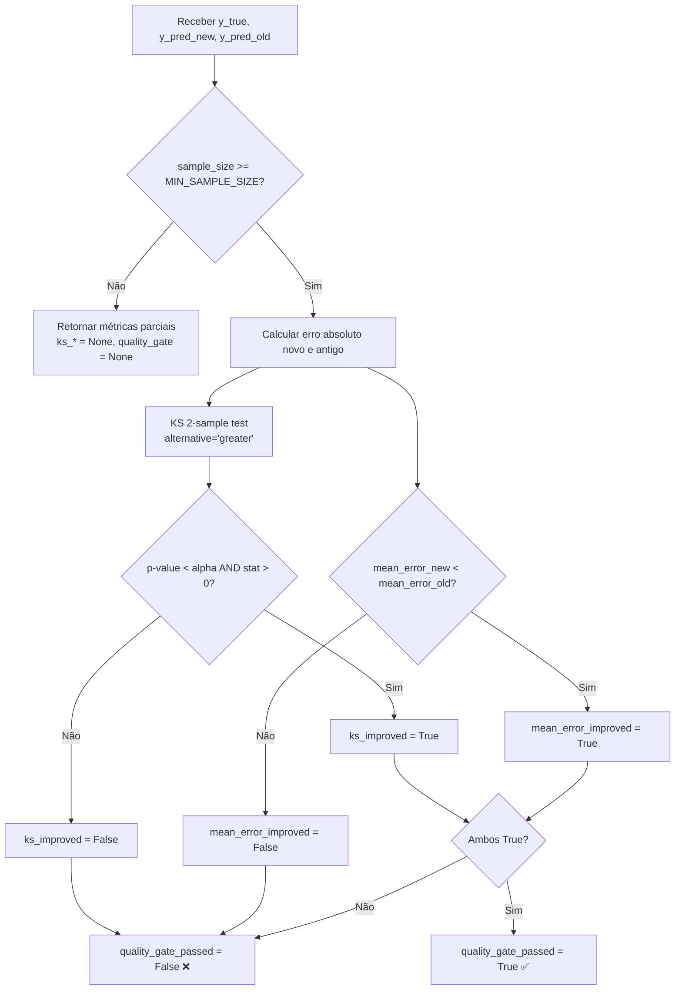
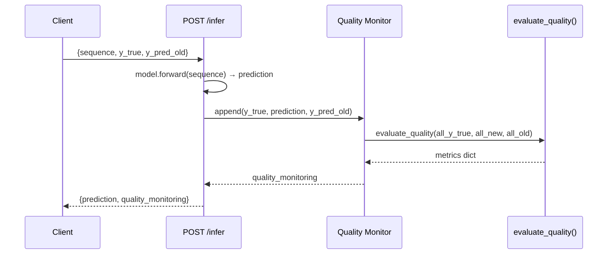

# Módulo `inference` — Monitoramento de Qualidade de Modelos

Este módulo implementa a avaliação estatística contínua da qualidade de predições, comparando um **modelo novo** com um **modelo antigo (baseline)**.

---

## Estrutura de Arquivos

| Arquivo | Responsabilidade |
|---|---|
| `quality.py` | Funções `absolute_error` e `evaluate_quality` |
| `__init__.py` | Exportações públicas do pacote |

---

## Conceito do Quality Gate

O quality gate é aprovado **somente** quando **ambas** as condições se verificam:

1. **Erro médio menor** — o novo modelo apresenta erro absoluto médio inferior ao baseline.
2. **Teste KS significativo** — o teste de Kolmogorov-Smirnov (unilateral, `greater`) confirma que a distribuição de erros do novo modelo é estocasticamente menor, com p-valor abaixo de `alpha`.



---

## Constantes

| Constante | Valor | Descrição |
|---|---|---|
| `ALPHA` | `0.05` | Nível de significância padrão para o teste KS |
| `MIN_SAMPLE_SIZE` | `31` | Número mínimo de observações antes de executar o teste estatístico |

---

## Passo-a-Passo: Como Usar

### 1. Uso direto da função

```python
from app.inference.quality import evaluate_quality

result = evaluate_quality(
    y_true=[10.0, 11.0, 12.0] * 15,       # 45 observações
    y_pred_new=[10.1, 11.1, 12.1] * 15,    # Novo modelo (erro ~0.1)
    y_pred_old=[10.5, 11.5, 12.5] * 15,    # Baseline (erro ~0.5)
)

print(result)
# {
#   "sample_size": 45,
#   "mean_error_new": 0.1,
#   "mean_error_old": 0.5,
#   "mean_error_improved": True,
#   "ks_statistic": ...,
#   "ks_pvalue": ...,
#   "ks_improved": True,
#   "quality_gate_passed": True,
# }
```

### 2. Integração com o endpoint `/infer`

Ao enviar `y_true` e `y_pred_old` junto do payload de inferência, o endpoint acumula as predições em memória e retorna automaticamente as métricas de qualidade:



### 3. Avaliação em lote via `/evaluate_quality`

```bash
curl -X POST http://localhost:8000/evaluate_quality \
  -H "Content-Type: application/json" \
  -d '{
    "y_true": [10.0, 11.0, 12.0],
    "y_pred_old": [10.5, 11.5, 12.5]
  }'
```

---

## Estrutura do Retorno

| Campo | Tipo | Descrição |
|---|---|---|
| `sample_size` | `int` | Número de observações avaliadas |
| `minimum_sample_size` | `int` | Limiar para teste estatístico |
| `mean_error_new` | `float` | Erro absoluto médio do modelo novo |
| `mean_error_old` | `float` | Erro absoluto médio do baseline |
| `mean_error_improved` | `bool` | `True` se erro novo < erro antigo |
| `ks_statistic` | `float \| None` | Estatística KS (ou `None` se amostra insuficiente) |
| `ks_pvalue` | `float \| None` | P-valor do teste KS |
| `ks_improved` | `bool \| None` | `True` se o teste suporta o modelo novo |
| `quality_gate_passed` | `bool \| None` | `True` quando **ambos** os critérios passam |

---

## Testes Relacionados

- `tests/test_inference_quality_monitor.py` — Testa `evaluate_quality`, endpoint `/infer` com monitoramento e rejeição de payload parcial.
- `tests/test_model_quality.py` — Testes estatísticos sobre dados de benchmark (KS + erro médio).

```bash
pytest tests/test_inference_quality_monitor.py tests/test_model_quality.py -v
```
