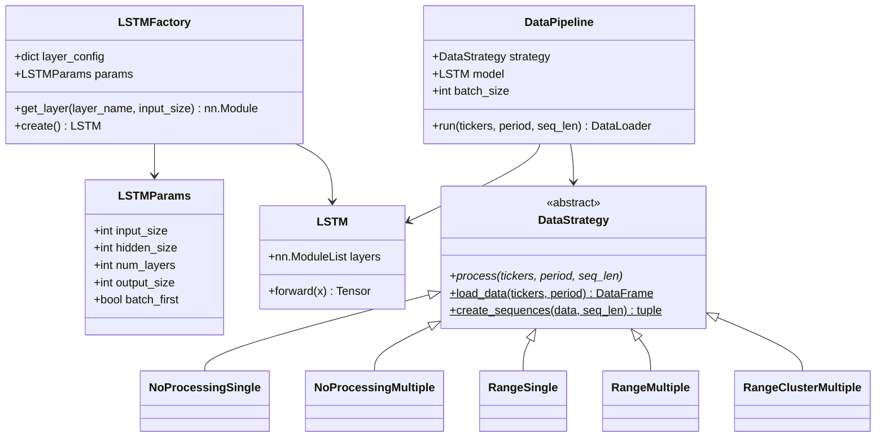
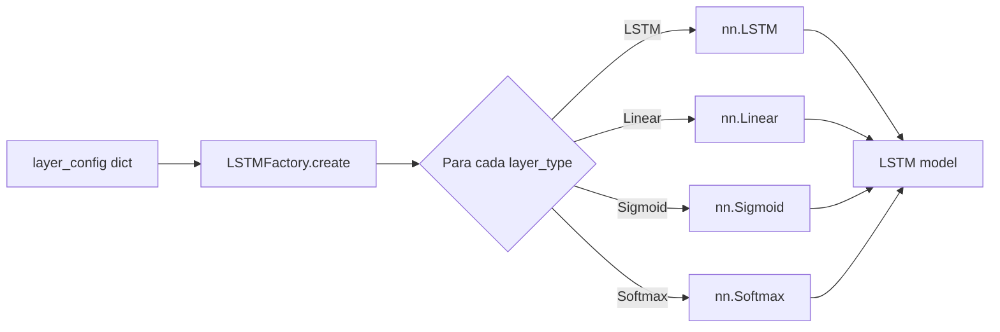
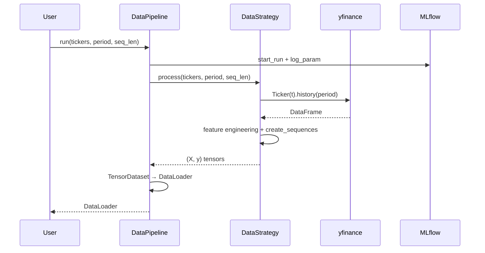

# Módulo `model` — Arquitetura LSTM e Pipeline de Dados

Este módulo contém a definição do modelo LSTM, sua fábrica (Factory Method), os hiperparâmetros validados e o pipeline de dados baseado no padrão Strategy.

---

## Estrutura de Arquivos

| Arquivo | Responsabilidade |
|---|---|
| `lstm_params.py` | Modelo Pydantic com os hiperparâmetros da LSTM |
| `lstm.py` | Classe `LSTM` (nn.Module) e `LSTMFactory` |
| `data.py` | Estratégias de ingestão e processamento de dados |
| `__init__.py` | Exportações do pacote |

---

## Visão Geral da Arquitetura



---

## Passo-a-Passo: Como Usar

### 1. Definir Hiperparâmetros

```python
from app.model.lstm_params import LSTMParams

params = LSTMParams(
    input_size=4,       # High, Low, Close, Volume
    hidden_size=64,
    num_layers=2,
    output_size=1,      # Preço de fechamento previsto
    batch_first=True,
)
```

### 2. Construir o Modelo com a Factory

```python
from app.model.lstm import LSTMFactory

layer_config = {
    "lstm1": "LSTM",
    "linear1": "Linear",
    "sigmoid1": "Sigmoid",
}

factory = LSTMFactory(layer_config, params)
model = factory.create()
print(model)
```

O fluxo interno da factory é:



### 3. Escolher uma Estratégia de Dados

| Estratégia | Tickers | Feature Engineering | Clustering |
|---|---|---|---|
| `NoProcessingSingle` | 1 | Nenhum | Não |
| `NoProcessingMultiple` | N | Nenhum | Não |
| `RangeSingle` | 1 | High - Low | Não |
| `RangeMultiple` | N | High - Low | Não |
| `RangeClusterMultiple` | N | High - Low | DBSCAN |

### 4. Executar o Pipeline de Dados

```python
from app.model.data import DataPipeline, RangeMultiple

strategy = RangeMultiple()
pipeline = DataPipeline(strategy, model, batch_size=32)

loader = pipeline.run(
    tickers=["AAPL", "MSFT"],
    period="1y",
    seq_len=30,
)

for X_batch, y_batch in loader:
    print(X_batch.shape, y_batch.shape)
    break
```



---

## Camadas Suportadas pela Factory

| Nome | Classe PyTorch | Parâmetros de entrada |
|---|---|---|
| `LSTM` | `nn.LSTM` | `input_size`, `hidden_size`, `num_layers`, `batch_first` |
| `Linear` | `nn.Linear` | `input_size` (dinâmico), `output_size` |
| `Sigmoid` | `nn.Sigmoid` | — |
| `Softmax` | `nn.Softmax(dim=1)` | — |

Caso um `layer_name` não reconhecido seja fornecido, a factory levanta `ValueError`.

---

## Testes Relacionados

- `tests/test_lstm_factory.py` — Instanciação, forward pass, camadas inválidas.
- `tests/test_lstm_data.py` — Estratégias de dados com yfinance mockado.

Execute com:

```bash
pytest tests/test_lstm_factory.py tests/test_lstm_data.py -v
```
