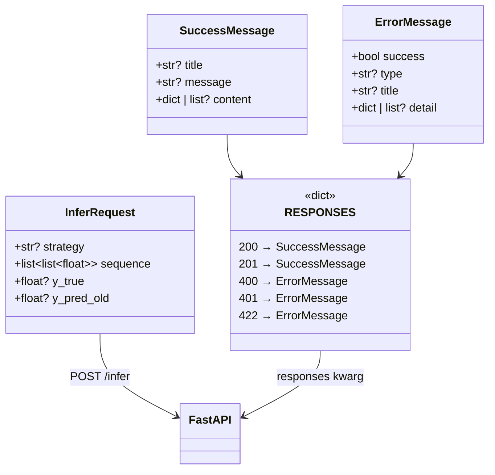
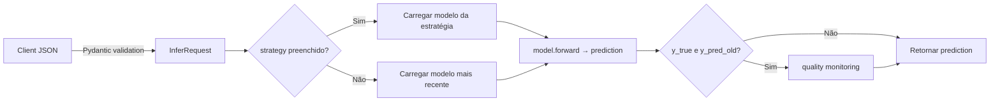

# Módulo `schemas` — Contratos de Requisição e Resposta

Este módulo centraliza os modelos Pydantic e dataclasses que definem os contratos de entrada (request) e saída (response) da API FastAPI.

---

## Estrutura de Arquivos

| Arquivo | Responsabilidade |
|---|---|
| `endpoints.py` | Schemas de requisição (`InferRequest`) |
| `responses.py` | Mensagens de resposta (`SuccessMessage`, `ErrorMessage`) e mapeamento `RESPONSES` |
| `__init__.py` | Exportações públicas do pacote |

---

## Diagrama de Relação com a API



---

## Passo-a-Passo: Como Usar

### 1. Enviar uma Requisição de Inferência

O `InferRequest` é o modelo de entrada do endpoint `POST /infer`:

```python
# Exemplo de payload JSON
{
    "strategy": "NoProcessingSimple",
    "sequence": [
        [187.11, 184.50, 186.80, 45000000.0],
        [188.20, 185.10, 187.95, 42000000.0],
        [189.00, 186.00, 188.75, 39800000.0]
    ],
    "y_true": 189.45,
    "y_pred_old": 190.18
}
```



### 2. Campos do `InferRequest`

| Campo | Tipo | Obrigatório | Descrição |
|---|---|---|---|
| `strategy` | `str \| None` | Não | Nome da estratégia/modelo. Se omitido usa o mais recente |
| `sequence` | `list[list[float]]` | **Sim** | Sequência de entrada com shape `[seq_len, input_size]` |
| `y_true` | `float \| None` | Não | Valor real observado para monitoramento de qualidade |
| `y_pred_old` | `float \| None` | Não | Predição do modelo baseline para comparação |

> **Regra de validação**: `y_true` e `y_pred_old` devem ser enviados **juntos**. Enviar apenas um resulta em HTTP 400.

### 3. Mensagens de Resposta

#### Sucesso (2xx)
```json
{
    "title": "Model trained",
    "message": "Training completed successfully",
    "content": {"model_path": "/app/train/.models/NoProcessingSimple.pt"}
}
```

#### Erro (4xx)
```json
{
    "success": false,
    "type": "Validation Error",
    "title": "Your request parameters didn't validate.",
    "detail": {"invalid-params": [...]}
}
```

### 4. Mapeamento `RESPONSES`

O dicionário `RESPONSES` é injetado em `FastAPI(responses=RESPONSES)` para gerar a documentação OpenAPI automaticamente:

| Código HTTP | Modelo |
|---|---|
| 200 OK | `SuccessMessage` |
| 201 Created | `SuccessMessage` |
| 202 Accepted | `SuccessMessage` |
| 400 Bad Request | `ErrorMessage` |
| 401 Unauthorized | `ErrorMessage` |
| 403 Forbidden | `ErrorMessage` |
| 422 Unprocessable Entity | `ErrorMessage` |

---

## Adicionando Novos Schemas

1. Crie a classe Pydantic/dataclass no arquivo apropriado (`endpoints.py` para request, `responses.py` para response).
2. Exporte em `__init__.py`.
3. Importe em `main.py` e utilize no `def` do endpoint.

```python
# endpoints.py
class TrainRequest(BaseModel):
    """Request payload for POST /train."""
    strategy: str = Field(..., description="Nome da estratégia de treinamento.")
    params: dict = Field(..., description="Hiperparâmetros do treino.")
```
