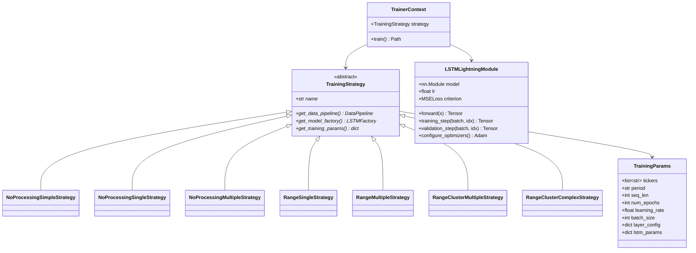
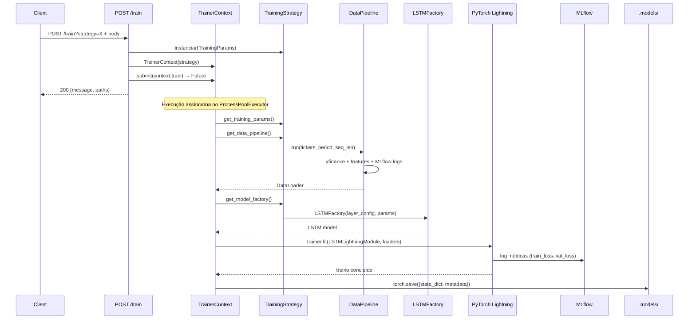
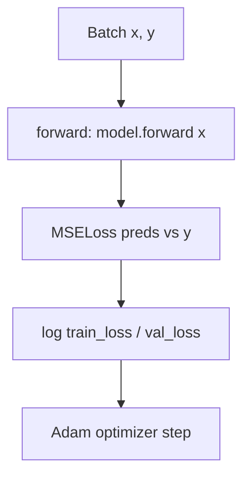

# Módulo `train` — Estratégias de Treinamento e Orquestração

Este módulo implementa o pipeline de treinamento completo de modelos LSTM para previsão de preços de ações, utilizando **PyTorch Lightning** para treino e **MLflow** para rastreamento de experimentos.

---

## Estrutura de Arquivos

| Arquivo | Responsabilidade |
|---|---|
| `model.py` | `TrainingParams`, `LSTMLightningModule`, `TrainingStrategy` (abstract), 7 estratégias concretas e `TrainerContext` |
| `__init__.py` | Exportações públicas do pacote |
| `.models/` | Diretório criado automaticamente para armazenar artefatos `.pt` |

---

## Diagrama de Classes



---

## Estratégias Disponíveis

| Estratégia | Tickers | Feature Eng. | Clustering | Data Strategy |
|---|---|---|---|---|
| `NoProcessingSimpleStrategy` | N | Nenhum | Não | `NoProcessingMultiple` |
| `NoProcessingSingleStrategy` | 1 | Nenhum | Não | `NoProcessingSingle` |
| `NoProcessingMultipleStrategy` | N | Nenhum | Não | `NoProcessingMultiple` |
| `RangeSingleStrategy` | 1 | High - Low | Não | `RangeSingle` |
| `RangeMultipleStrategy` | N | High - Low | Não | `RangeMultiple` |
| `RangeClusterMultipleStrategy` | N | High - Low | DBSCAN | `RangeClusterMultiple` |
| `RangeClusterComplexStrategy` | N | High - Low | DBSCAN | `RangeClusterMultiple` |

---

## Passo-a-Passo: Como Treinar um Modelo

### 1. Via API (recomendado)

```bash
curl -X POST "http://localhost:8000/train?strategy=RangeMultipleStrategy" \
  -H "Content-Type: application/json" \
  -d '{
    "tickers": ["AAPL", "MSFT"],
    "period": "1y",
    "seq_len": 30,
    "num_epochs": 50,
    "learning_rate": 0.001,
    "batch_size": 32,
    "layer_config": {"lstm1": "LSTM", "linear1": "Linear"},
    "lstm_params": {
      "input_size": 10,
      "hidden_size": 64,
      "num_layers": 2,
      "output_size": 1,
      "batch_first": true
    }
  }'
```

### 2. Via Código Python

```python
from app.train.model import (
    TrainingParams,
    RangeMultipleStrategy,
    TrainerContext,
)

params = TrainingParams(
    tickers=["AAPL", "MSFT"],
    period="1y",
    seq_len=30,
    num_epochs=50,
    learning_rate=0.001,
    batch_size=32,
    layer_config={"lstm1": "LSTM", "linear1": "Linear"},
    lstm_params={
        "input_size": 10,
        "hidden_size": 64,
        "num_layers": 2,
        "output_size": 1,
        "batch_first": True,
    },
)

strategy = RangeMultipleStrategy(params)
context = TrainerContext(strategy)
model_path = context.train()
print(f"Modelo salvo em: {model_path}")
```

---

## Fluxo de Treinamento



---

## Artefato Salvo (`.pt`)

Cada modelo é salvo como um dicionário contendo:

| Chave | Tipo | Descrição |
|---|---|---|
| `state_dict` | `dict` | Pesos do modelo |
| `layer_config` | `dict` | Configuração de camadas |
| `lstm_params` | `dict` | Hiperparâmetros LSTM (serializáveis) |
| `strategy` | `str` | Nome da estratégia usada |
| `training_params` | `dict` | Parâmetros do treino (tickers, period, etc.) |

---

## LSTMLightningModule

Wrapper para treino com PyTorch Lightning:



| Método | Descrição |
|---|---|
| `forward(x)` | Delega para `self.model(x)` |
| `training_step(batch, idx)` | Calcula e loga `train_loss` |
| `validation_step(batch, idx)` | Calcula e loga `val_loss` |
| `configure_optimizers()` | Retorna `Adam(lr=self.lr)` |

---

## Adicionando Uma Nova Estratégia

1. Crie uma nova `DataStrategy` em `app/model/data.py` (se necessário).
2. Crie a classe em `train/model.py` herdando `TrainingStrategy`:

```python
class MinhaEstrategia(TrainingStrategy):
    def __init__(self, training_params: TrainingParams):
        self._name = "MinhaEstrategia"
        super().__init__(training_params)

    @property
    def name(self): return self._name

    def get_data_pipeline(self) -> DataPipeline:
        factory = LSTMFactory(self.layer_config, self.lstm_params)
        model = factory.create()
        return DataPipeline(MinhaDataStrategy(), model, batch_size=self.params['batch_size'])

    def get_model_factory(self) -> LSTMFactory:
        return LSTMFactory(self.layer_config, self.lstm_params)

    def get_training_params(self) -> dict:
        return self.params
```

3. Exporte em `train/__init__.py`.

---

## Testes Relacionados

- `tests/test_training_strategies.py` — Valida interface, pipeline e factory de todas as estratégias.

```bash
pytest tests/test_training_strategies.py -v
```
