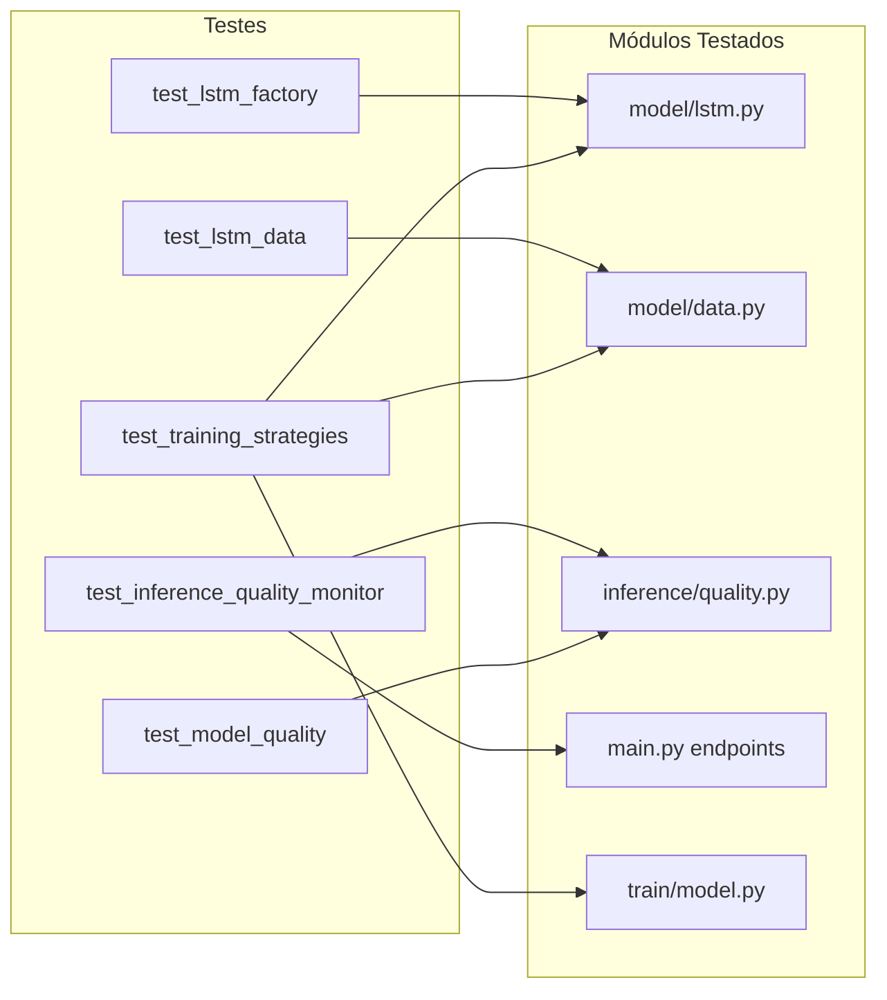
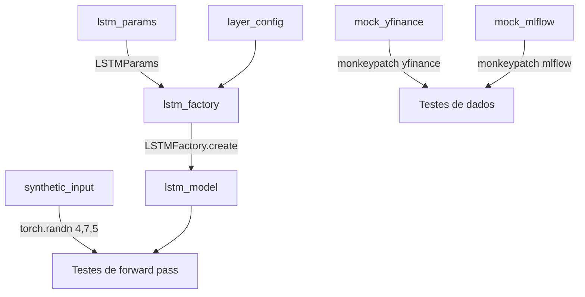

# Módulo `tests` — Suíte de Testes Automatizados

Este módulo contém todos os testes unitários e de integração para a camada de produtização do serviço LSTM.

---

## Estrutura de Arquivos

| Arquivo | Escopo | Descrição |
|---|---|---|
| `conftest.py` | Global | Fixtures compartilhadas: `lstm_params`, `layer_config`, `lstm_factory`, `lstm_model`, `synthetic_input`, `mock_yfinance`, `mock_mlflow` |
| `test_lstm_factory.py` | `model/lstm.py` | Instanciação da factory, forward pass, camadas inválidas, múltiplas LSTMs, Sigmoid |
| `test_lstm_data.py` | `model/data.py` | Estratégias de dados (5 variantes) com yfinance e MLflow mockados |
| `test_inference_quality_monitor.py` | `inference/quality.py` + `main.py` | `evaluate_quality`, endpoint `/infer` com monitoramento, rejeição de payload parcial |
| `test_model_quality.py` | Qualidade estatística | Teste KS e erro médio sobre dados de benchmark (`data/benchmark_predictions.csv`) |
| `test_training_strategies.py` | `train/model.py` | Interface, pipeline e factory de todas as 7 estratégias |

---

## Diagrama de Cobertura



---

## Passo-a-Passo: Como Executar os Testes

### 1. Instalar dependências de teste

```bash
cd productization/src
pip install -e ".[test]"
```

### 2. Executar toda a suíte

```bash
pytest tests/ -v
```

### 3. Executar apenas um módulo

```bash
# Testes da factory LSTM
pytest tests/test_lstm_factory.py -v

# Testes de estratégias de dados
pytest tests/test_lstm_data.py -v

# Testes de monitoramento de qualidade
pytest tests/test_inference_quality_monitor.py -v

# Testes de qualidade estatística (requer benchmark CSV)
pytest tests/test_model_quality.py -v

# Testes de estratégias de treinamento
pytest tests/test_training_strategies.py -v
```

### 4. Executar com cobertura

```bash
pytest tests/ --cov=app --cov-report=html -v
```

---

## Fixtures Compartilhadas (`conftest.py`)



| Fixture | Tipo | Descrição |
|---|---|---|
| `lstm_params` | `LSTMParams` | `input_size=5, hidden_size=8, num_layers=1, output_size=2` |
| `layer_config` | `dict` | `{"lstm1": "LSTM", "linear1": "Linear", "softmax1": "Softmax"}` |
| `lstm_factory` | `LSTMFactory` | Factory configurada com as fixtures acima |
| `lstm_model` | `LSTM` | Modelo criado pela factory |
| `synthetic_input` | `Tensor` | Shape `(4, 7, 5)` — batch=4, seq_len=7, features=5 |
| `mock_yfinance` | `-` | Substitui `yfinance.Ticker.history` com dados fictícios (10 dias) |
| `mock_mlflow` | `-` | Neutraliza `mlflow.log_param`, `log_metric`, `start_run` |

---

## Detalhamento dos Testes

### `test_lstm_factory.py`

| Teste | Verifica |
|---|---|
| `test_lstm_factory_instantiation` | Factory cria modelo com número correto de camadas |
| `test_lstm_forward_pass` | Output shape correto + Softmax soma a 1 |
| `test_lstm_factory_invalid_layer` | `ValueError` para camada não suportada |
| `test_lstm_factory_multiple_lstm_layers` | Duas camadas LSTM em sequência |
| `test_lstm_factory_sigmoid_layer` | Output no intervalo [0, 1] com Sigmoid |

### `test_lstm_data.py`

| Teste | Estratégia | Verifica |
|---|---|---|
| `test_no_processing_single` | `NoProcessingSingle` | Tensores válidos, seq_len correto |
| `test_no_processing_multiple` | `NoProcessingMultiple` | Múltiplos tickers concatenados |
| `test_range_single` | `RangeSingle` | +1 feature (Range) |
| `test_range_multiple` | `RangeMultiple` | Features corretas para N tickers |
| `test_range_cluster_multiple` | `RangeClusterMultiple` | +1 feature (Cluster label) |

### `test_inference_quality_monitor.py`

| Teste | Verifica |
|---|---|
| `test_evaluate_quality_replicates_mean_and_ks_criteria` | Quality gate aprovado com dados sintéticos |
| `test_infer_endpoint_returns_quality_monitoring` | `/infer` retorna `quality_monitoring` no body |
| `test_infer_endpoint_rejects_partial_quality_payload` | HTTP 400 quando `y_pred_old` está ausente |

### `test_model_quality.py`

| Teste | Verifica |
|---|---|
| `test_novo_modelo_melhor_que_antigo_com_kolmogorov_smirnov` | Teste KS sobre benchmark CSV |
| `test_novo_modelo_tem_menor_erro_medio_no_benchmark` | Erro médio novo < antigo |

### `test_training_strategies.py`

Teste parametrizado que valida **todas as 7 estratégias**:

| Aspecto | Validação |
|---|---|
| `name` | Corresponde ao nome esperado |
| `get_training_params()` | Contém todos os parâmetros fornecidos |
| `get_data_pipeline()` | Retorna pipeline com a `DataStrategy` correta |
| `get_model_factory()` | Retorna `LSTMFactory` com config correta |
